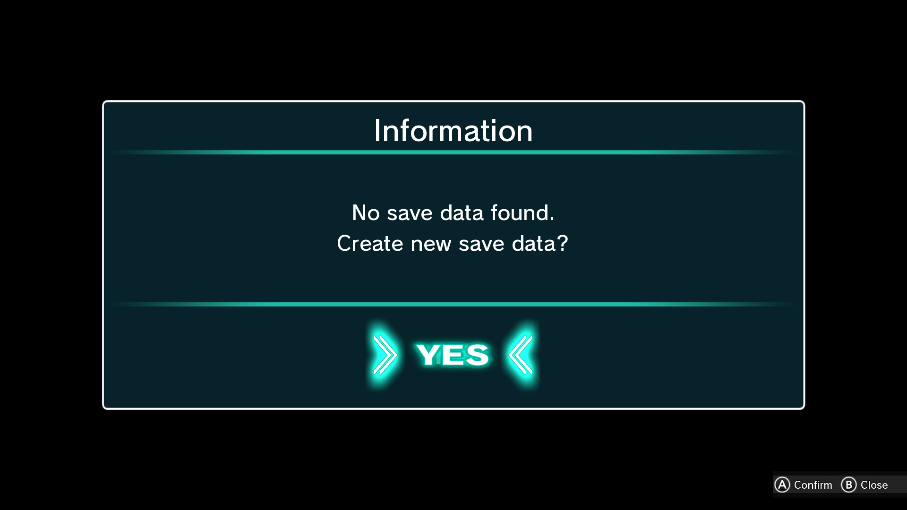

# Densha de GO!! Hashirou Yamanote-sen — English Translation Mod

Complete English translation patch for **Densha de GO!! Hashirou Yamanote-sen** (電車でGO！！ はしろう山手線) on Nintendo Switch.

- **Title ID:** `0100BC501355A000`
- **Engine:** Unreal Engine 4 (UE4.25 Cooked Switch Build)
- **Format:** LayeredFS Mod / Pak Patch (`pakchunk0-Switch_99_P.pak` + `pakchunk99-Switch.pak` + LocRes + Textures)



---

## 🌟 Translation Scope & Highlights

- **100% of In-Game Text & Dialog:** Over 2,800 strings translated across menus, tutorials, missions, rankings, and sound subtitles.
- **All 38 DataTables Patched:** Complete translation of all gameplay data tables (mission briefings, route descriptions, badges, wappens, station announcements, and in-game tips).
- **Translated UI Textures:**
  - Save/Confirmation dialog Yes/No buttons rendered directly from the original game typeface (**FOT-Rodin Pro EB**).
  - Authentic multi-pass neon cyan glowing shader effects matching the native UI aesthetics.
  - Tegra X1 Block-Linear swizzled BC7 compression.
- **Accurate Railway Terminology:**
  - Master Controller (**Mascon / マスコン**) and brake notches (B1–B8, EB).
  - Authentic JR East signaling: **Proceed** (進行), **Caution** (注意), **Warning** (警戒), **Stop** (停止), **Home Signal** (場内), **Departure Signal** (出発), **Block Signals** (第1～8閉塞).
  - Train dynamics: **Acceleration** (力行), **Coasting** (惰行), **Constant Speed Zone** (定速帯), **Stopping Position** (停車位置), **Point and Call** (指差喚呼).
  - Loop directions: **Inner Loop** (内回り - Counter-clockwise) / **Outer Loop** (外回り - Clockwise).
- **All Station Names:** Official romanized station names for all 30 Yamanote Line stations, plus Chuo, Sobu, and Osaka/Kansai routes.
- **Bug Fixes & Polish:**
  - Resolved string truncation on button prompt labels (e.g. `(A) Confirm`, `(B) Close`).
  - Corrected Tegra X1 block-linear mip alignment offsets for pixel-perfect texture injection.

---

## 📦 Installation Instructions

### Option A: Nintendo Switch Hardware (Atmosphere CFW)

1. Connect your Nintendo Switch microSD card to your PC (via USB, FTP, or card reader).
2. Copy the `atmosphere` folder from this repository (or from the release zip) directly to the **root of your microSD card**.
   - Destination path on microSD:
     ```text
     sdmc:/atmosphere/contents/0100BC501355A000/romfs/
     ```
3. If prompted to merge folders or replace files, select **Yes**.
4. Boot into Atmosphere CFW and start the game. The English translation will load automatically!

> [!NOTE]
> Having trouble loading the mod? Please read our [TROUBLESHOOTING.md](TROUBLESHOOTING.md) guide for solutions to common issues (Archive Bit, CFW verification, and LayeredFS sanity checks).

### Option B: Emulators (Ryujinx / Yuzu / Suyu)

1. Right-click **Densha de GO!! Hashirou Yamanote-sen** in your emulator's game library.
2. Select **Open Mods Directory**.
3. Create a subfolder named `English Translation` (or any preferred name).
4. Copy the `romfs` folder located inside `atmosphere/contents/0100BC501355A000/` into that folder:
   ```text
   <Mods Directory>/English Translation/romfs/...
   ```
5. Ensure mods are enabled in your emulator properties, and launch the game.

---

## 🛠️ Repository Contents

```text
├── atmosphere/
│   └── contents/
│       └── 0100BC501355A000/
│           └── romfs/
│               └── DgocGame/
│                   └── Content/
│                       ├── DgocArt/                 # English UI button textures (BC7 Tegra swizzled)
│                       ├── DgocBlueprints/          # Dialog & UI widget overrides
│                       ├── Localization/            # Compiled Game.locres & DgocGame.locres
│                       └── Paks/
│                           ├── pakchunk0-Switch_99_P.pak  # High-priority patch pak
│                           └── pakchunk99-Switch.pak      # Fallback patch pak
├── data/
│   ├── translations_dictionary.json                 # Complete bilingual translation mapping
│   └── game_all_texts_en.txt                        # Full translated text dump with UE4 CityHash keys
├── media/
│   └── screenshot_save_dialog.png                   # Verified in-game screenshot
├── scripts/
│   ├── patch_all_datatables.py                      # DataTable unpacker and serializer
│   ├── patch_textures.py                            # Texture generator, BC7 compressor & swizzler
│   ├── apply_translations_to_locres.py              # LocRes compiler and string mapper
│   ├── batch_translate_all.py                       # Translation pipeline with domain glossary
│   ├── stage_files.py                               # Staging and pak repacking
│   ├── create_mod_dist.py                           # Distribution builder
│   └── create_release_zip.py                        # Release zip packager
├── tools/
│   └── tegra_tool/                                  # High-performance Rust Tegra swizzler & BC7 encoder
├── TROUBLESHOOTING.md                               # Comprehensive LayeredFS & mod troubleshooting guide
└── README.md
```

---

## 🏗️ Building from Source

To rebuild the mod files from unpacked game assets:

1. **Compile the Tegra Tool:**
   ```bash
   cd tools/tegra_tool
   cargo build --release
   ```
2. **Patch all DataTables:**
   ```bash
   python scripts/patch_all_datatables.py
   ```
3. **Patch Textures & Repack Paks:**
   ```bash
   python scripts/patch_textures.py
   ```
4. **Build Distribution:**
   ```bash
   python scripts/create_release_zip.py
   ```

---

## ⚖️ Disclaimer

This fan translation is not affiliated with, endorsed by, or sponsored by TAITO Corporation, Square Enix, or Nintendo. All trademarks, character names, railway logos, and copyrighted materials belong to their respective owners.
