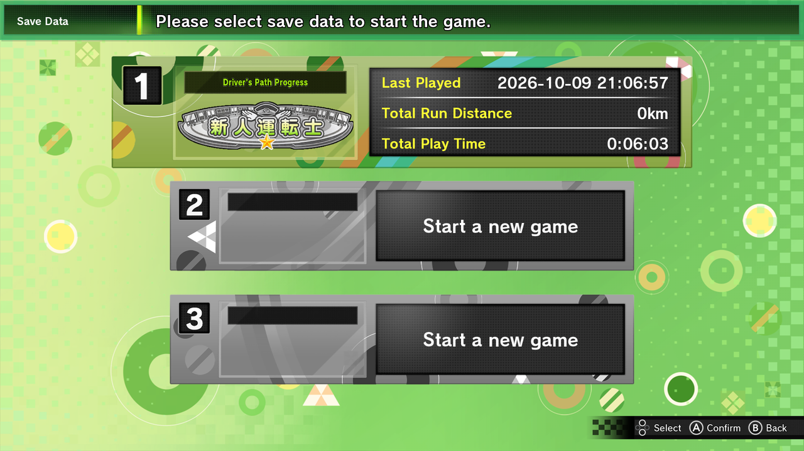
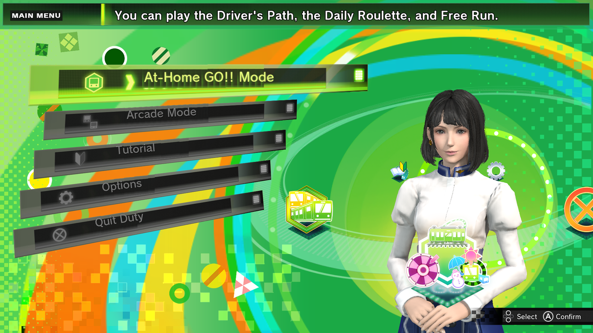
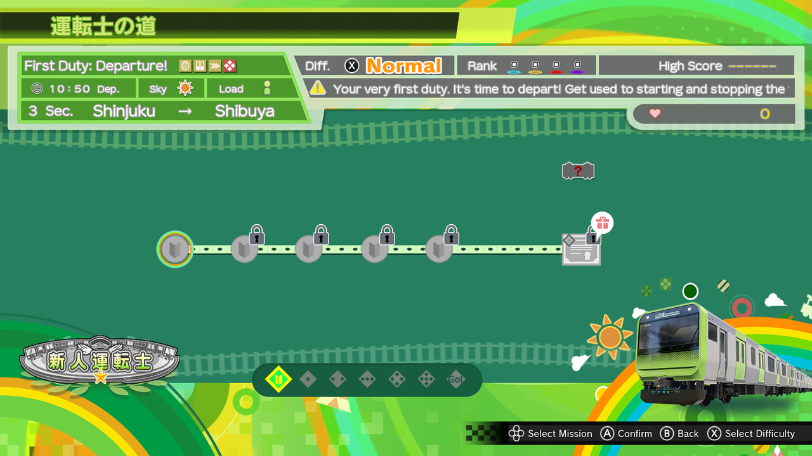
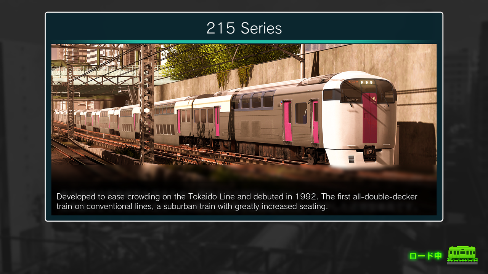
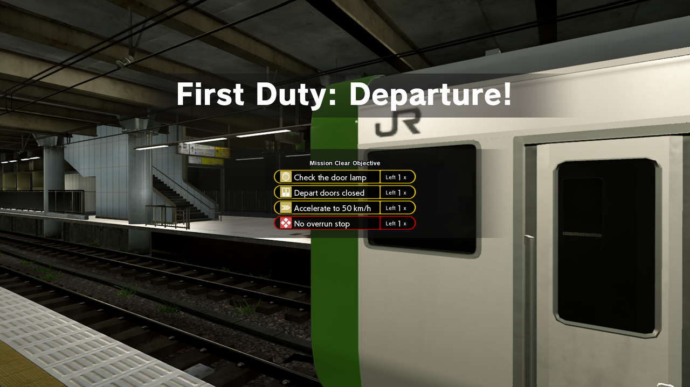
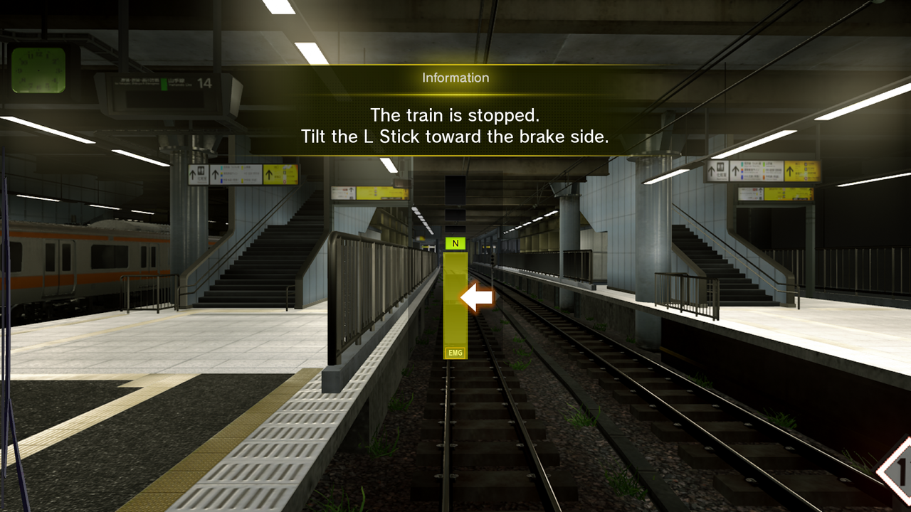

# Densha de GO!! Hashirou Yamanote-sen — English Translation Mod

English translation patch for **Densha de GO!! Hashirou Yamanote-sen** (電車でGO！！ はしろう山手線) on Nintendo Switch.

- **Title ID:** `0100BC501355A000`
- **Engine:** Unreal Engine 4 (UE4.25 Cooked Switch Build)
- **Format:** LayeredFS Mod / Pak Patch (`pakchunk0-Switch_99_P.pak` + `pakchunk99-Switch.pak` + LocRes + Textures)


## 📊 Translation Progress

| Area | Progress | Notes |
|---|---|---|
| Game text (menus, missions, tips, dialogs) | `████████████████████` **99%** | ~99% of ~2,200 unique strings found; dev-only placeholders excluded |
| Image textures (HUD, menus, maps, help pages) | `█████████████████░░░` **84%** | 235 of 280 Japanese-bearing textures patched (some remaining flags are false positives); small text inside embedded screenshots remains |
| **Overall (average)** | `██████████████████░░` **91%** | Estimated; see Known Gaps |

## 📸 Screenshots

| | |
|---|---|
|  |  |
|  |  |
|  |  |

---

## 🌟 Translation Scope & Highlights

- **In-Game Text & Dialog:** Roughly 4,300 strings translated across menus, tutorials, mission names and descriptions, mission goals, unlock messages, help and loading-tip text, rankings, announcements, and subtitles. A few leftovers remain (see Known Gaps).
- **Gameplay DataTables Patched:** Mission briefings, route descriptions, badges, wappens, station announcements, Support/loading tips, mission goals and reward messages.
- **Complete English HUD Textures (All 6 Trains):**
  - E235 Series, E233 Series, E231 Series 500 Subseries, 205 Series, 103 Series, and E259 Series Narita Express.
  - Fully translated Speedometers, Speed Limit bases, Air Pressure (kPa) meters, Emergency Brake indicators (EMG), Stop Position / Stop Time indicators, and Ridership gauges.
- **Complete English Menu & Results Screens:**
  - Title Screen: Authentic Yamanote green "GAME START" button (normal and glowing selected states).
  - Main Menu: Header banners and mode titles.
  - Driver's Path: Progress and mastery badges.
  - Mission Result: Arrival time offsets ("Arrival Ahead" / "Arrival Late"), delay indicator, and seconds.
  - Total Result: Difficulty, Weather, Ridership, Acquired Score, High Score, and Rank headers.
  - Free Mode: Weather (Clear, Rain, Snow), Time of Day (Morning, Day), Ridership levels, and full configuration side panel headers.
  - Daily Roulette: Route Selection and draw instruction banners.
  - Options: Brightness calibration ("Dark" / "Bright"), Master Controller notch diagrams, Near Zero and Double Zero indicators.
- **Complete Tutorial & Train Profile Cards:**
  - Futaba Kasuga full character profile card.
  - Complete historical and technical overview cards for all trains (185, 215, 251, E217, E231, E233, E235, E259 series).
  - In-game tutorial explanation diagrams and score penalty callouts.
- **Authentic Typographical & Shader Quality:**
  - Authentic game typeface (**FOT-Rodin Pro EB / M / DB** and **Roboto Bold**).
  - Tegra X1 Block-Linear swizzled BC7 and BGRA compression for seamless, artifact-free Switch rendering.
  - Multi-pass neon cyan glowing shader effects matching native UI aesthetics.
- **Accurate Railway Terminology:**
  - Master Controller (**Mascon / マスコン**) and brake notches (B1–B8, EB).
  - Authentic JR East signaling: **Proceed** (進行), **Caution** (注意), **Warning** (警戒), **Stop** (停止), **Home Signal** (場内), **Departure Signal** (出発), **Block Signals** (第1～8閉塞).
  - Train dynamics: **Acceleration** (力行), **Coasting** (惰行), **Constant Speed Zone** (定速帯), **Stopping Position** (停車位置), **Point and Call** (指差喚呼).
  - Loop directions: **Inner Loop** (内回り - Counter-clockwise) / **Outer Loop** (外回り - Clockwise).
- **All Station Names:** Official romanized station names for all 30 Yamanote Line stations, plus Chuo, Sobu, and Osaka/Kansai routes.

---

## Known Gaps

- Some Japanese text is baked into small embedded game screenshots inside help pages and a few HUD/result sample images; these are not translated.
- Station-name map labels and route lists are translated with overlays; a few spots may still look slightly rough.
- English labels are longer than the Japanese originals in places, so some HUD info bars can overlap.
- Developer-only strings (test missions, placeholder text) are intentionally left untouched.

---

## 📦 Installation Instructions

### Option A: Nintendo Switch Hardware (Atmosphere CFW)

1. Connect your Nintendo Switch microSD card to your PC (via USB, FTP, or card reader).
2. Copy the `atmosphere` folder from this repository (or from the release zip) directly to the **root of your microSD card**.
   - Destination path on microSD:
     ```text
     sdmc:/atmosphere/contents/0100BC501355A000/romfs/
     ```
3. If prompted to merge folders or replace files, select **Yes**.
4. Boot into Atmosphere CFW and start the game. The English translation will load automatically!

> [!NOTE]
> Having trouble loading the mod? Please read our [TROUBLESHOOTING.md](TROUBLESHOOTING.md) guide for solutions to common issues (Archive Bit, CFW verification, and LayeredFS sanity checks).

### Option B: Emulators (Ryujinx / Yuzu / Suyu)

1. Right-click **Densha de GO!! Hashirou Yamanote-sen** in your emulator's game library.
2. Select **Open Mods Directory**.
3. Create a subfolder named `English Translation` (or any preferred name).
4. Copy the `romfs` folder located inside `atmosphere/contents/0100BC501355A000/` into that folder:
   ```text
   <Mods Directory>/English Translation/romfs/...
   ```
5. Ensure mods are enabled in your emulator properties, and launch the game.

---

## 🛠️ Repository Contents

```text
├── atmosphere/
│   └── contents/
│       └── 0100BC501355A000/
│           └── romfs/
│               └── DgocGame/
│                   └── Content/
│                       ├── DgocArt/                 # English UI button textures (BC7 Tegra swizzled)
│                       ├── DgocBlueprints/          # Dialog & UI widget overrides
│                       ├── Localization/            # Compiled Game.locres & DgocGame.locres
│                       └── Paks/
│                           ├── pakchunk0-Switch_99_P.pak  # High-priority patch pak
│                           └── pakchunk99-Switch.pak      # Fallback patch pak
├── data/
│   ├── translations_dictionary.json                 # Complete bilingual translation mapping
│   └── game_all_texts_en.txt                        # Full translated text dump with UE4 CityHash keys
├── media/
│   └── screenshot_save_dialog.png                   # Verified in-game screenshot
├── scripts/
│   ├── patch_all_datatables.py                      # DataTable unpacker and serializer
│   ├── patch_textures.py                            # Texture generator, BC7 compressor & swizzler
│   ├── apply_translations_to_locres.py              # LocRes compiler and string mapper
│   ├── batch_translate_all.py                       # Translation pipeline with domain glossary
│   ├── stage_files.py                               # Staging and pak repacking
│   ├── create_mod_dist.py                           # Distribution builder
│   └── create_release_zip.py                        # Release zip packager
├── tools/
│   └── tegra_tool/                                  # High-performance Rust Tegra swizzler & BC7 encoder
├── TROUBLESHOOTING.md                               # Comprehensive LayeredFS & mod troubleshooting guide
└── README.md
```

---

## 🏗️ Building from Source

To rebuild the mod files from unpacked game assets:

1. **Compile the Tegra Tool:**
   ```bash
   cd tools/tegra_tool
   cargo build --release
   ```
2. **Patch all DataTables:**
   ```bash
   python scripts/patch_all_datatables.py
   ```
3. **Patch Textures & Repack Paks:**
   ```bash
   python scripts/patch_textures.py
   ```
4. **Build Distribution:**
   ```bash
   python scripts/create_release_zip.py
   ```

---

## ⚖️ Disclaimer

This fan translation is not affiliated with, endorsed by, or sponsored by TAITO Corporation, Square Enix, or Nintendo. All trademarks, character names, railway logos, and copyrighted materials belong to their respective owners.
